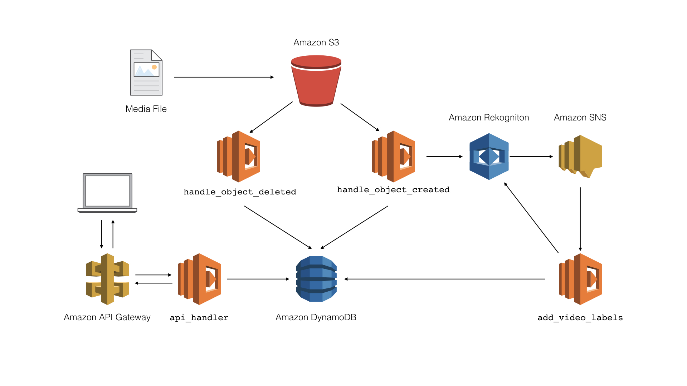

# Media Query

by chalice

## use rekognition api

```bash
aws rekognition detect-labels --image-bytes fileb://sample.jpg
```

# Architecture



# Clean

```bash
chalice delete
aws s3 rm s3://$MEDIA_BUCKET_NAME --recursive
aws cloudformation delete-stack --stack-name media-query
```
